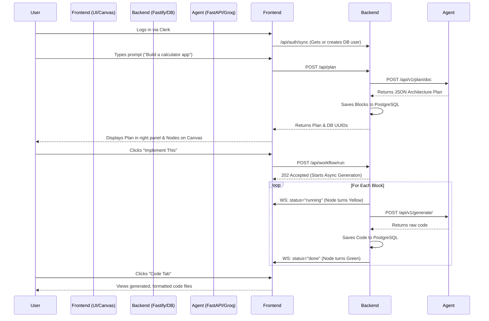

# CraftaStudio: End-to-End Project Report

## 1. Project Overview & Context
**CraftaStudio** is a premium, AI-powered software architecture and generation pipeline. It enables users to describe an application they want to build, automatically architects a robust plan using specialized AI agents, visualizes that architecture on an interactive canvas, and generates the production-ready code for each modular block—all within a single seamless workflow.

## 2. Technology Stack
The project is built on a modern, decoupled microservices architecture:

### Frontend
- **Framework**: Next.js 16 (App Router)
- **Styling**: Tailwind CSS with custom Glassmorphism and modern UI tokens (Shadcn UI inspired)
- **Authentication**: Clerk
- **Canvas/Visualization**: `@xyflow/react` (React Flow)
- **State Management**: React Hooks & Context

### Backend
- **Framework**: Fastify (Node.js)
- **Database**: PostgreSQL
- **ORM**: Prisma
- **Real-time Communication**: WebSockets (for block generation status updates)

### Agent Service
- **Framework**: FastAPI (Uvicorn running on Port 8005)
- **Primary LLM Provider**: Groq API
- **Primary Model**: `llama-3.3-70b-versatile` (Optimized for speed and complex reasoning)
- **Fallback Models**: Groq `llama-3.1-8b-instant`, Sarvam AI `sarvam-30b`

---

## 3. What Has Been Created (The Execution)
Over the course of development, we have transformed CraftaStudio from a static prototype into a fully functional, end-to-end code generation pipeline.

### ✅ Accomplishments
1. **Premium Architect Interface**: Built a high-end, responsive UI utilizing advanced CSS techniques (radial gradients, glassmorphism) for a professional look and feel.
2. **Interactive Canvas Engine**: Integrated React Flow to visualize the architecture plan as interconnected nodes (blocks).
3. **Robust "Plan" Pipeline**:
   - The user inputs a prompt.
   - The frontend calls the backend, which forwards the request to the Python Agent service.
   - The Agent uses strict JSON schema enforcement to return an architecture plan divided into specific modules (Frontend, Backend, Auth, etc.).
   - The backend persists this plan in PostgreSQL and displays it on the canvas.
4. **Resilient "Generation" Pipeline**:
   - Replaced a failing BullMQ/Redis queue system with **Direct In-Process Generation**.
   - The backend iterates through the generated blocks, calls the Agent service for code generation, and streams real-time updates back to the UI via WebSockets.
5. **Smart LLM Fallback System**:
   - Built a custom fallback handler in `gemini_client.py` and `llm_client.py`.
   - When Groq's daily 100k token limit is hit on the 70B model, it automatically degrades to the 8B model, and then to Sarvam AI, ensuring zero downtime for users.
6. **Output Sanitization**: Implemented robust regex sanitization (`strip_fences`) to guarantee the LLM's markdown formatting never breaks the codebase parser.

---

## 4. User Journey & Functionality Flow

The core user experience is designed to be frictionless, moving from idea to code in seconds.

---

## 5. Artificial Intelligence Context

### How We Generate Code
1. **Planning Phase**: We use a highly specific system prompt (`plan_doc.txt`) that forces the LLM to output a JSON array of `blocks`. Each block represents a distinct part of the app (e.g., `blk-ui`, `blk-db`).
2. **Generation Phase**: For each block, the Agent receives the block's metadata and the original user prompt. It uses a generation prompt (`block_coder.txt` or similar) to write the actual implementation code for that specific module.

### Why Groq?
We are using Groq because of its LPU (Language Processing Unit) inference engine, which provides lightning-fast token generation. Since writing code for 4-5 blocks simultaneously requires thousands of output tokens, standard APIs (like OpenAI) would be too slow. Groq generates the entire codebase in ~10-15 seconds.

---

## 6. What is Remaining (Future Roadmap)

While the generation pipeline is now stable, the following features are pending to make CraftaStudio a complete consumer product:

1. **Export Functionality**: 
   - Add a "Download Code" button that uses libraries like `jszip` to bundle the generated code blocks into a structured `.zip` folder.
2. **Live Preview Environment**:
   - Currently, the "Preview" tab is static. We need to implement a WebContainer or iframe-based rendering engine (similar to CodeSandbox) that takes the generated HTML/JS/CSS and runs it directly in the browser.
3. **Iterative Refinement (Chat with Code)**:
   - Allow users to click on a generated block, open a chat sidebar, and say "Change the color to blue" to trigger an isolated re-generation of just that block.
4. **Enhanced Error Handling on UI**:
   - Show clear toast notifications to the user if a specific block fails due to a rate limit or generation timeout.
