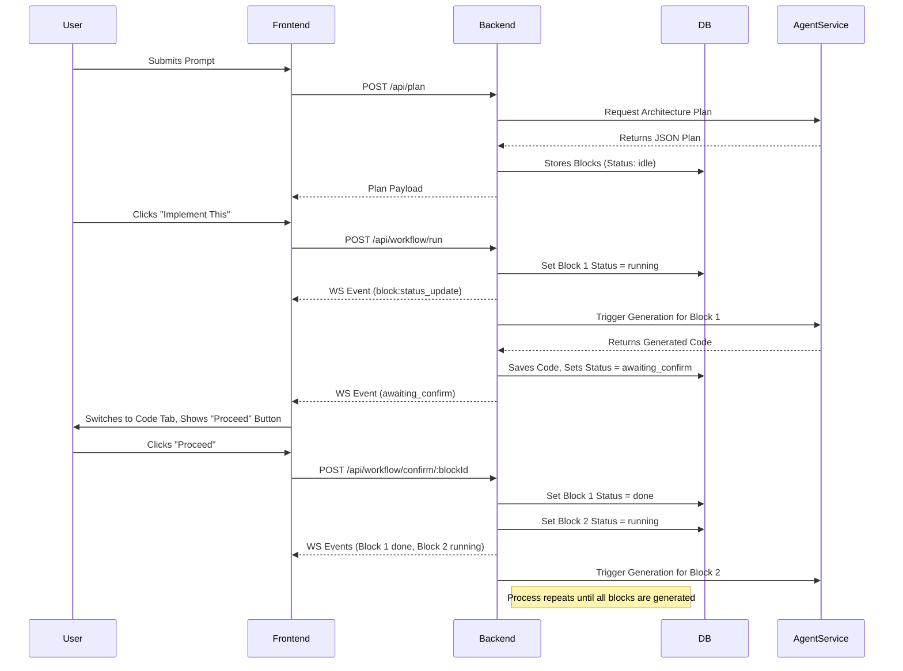

# CraftaStudio: End-to-End Project Report

## Overview
CraftaStudio is an AI-powered visual code generation pipeline and system architect. It allows users to prompt a high-level application idea, which is then dynamically broken down into architectural modules (blocks). The platform then generates the codebase module-by-module in a controlled, sequential process, allowing the user to review the generated code for each block before proceeding to the next.

---

## 🛠 Tech Stack

### Frontend
- **Framework**: Next.js 16 (React 19)
- **Styling**: Tailwind CSS, Shadcn UI
- **Animations & Visuals**: Framer Motion
- **Canvas Interface**: React Flow (for the node-based visual architecture diagram)
- **Authentication**: Clerk

### Backend (Orchestrator)
- **Framework**: Fastify (Node.js)
- **Database**: PostgreSQL
- **ORM**: Prisma
- **Real-time Communication**: WebSockets (ws) for live block status updates

### AI Agent Service
- **Framework**: FastAPI (Python)
- **Role**: Handles LLM orchestration, structured output parsing, and actual code generation based on the backend's requests.

---

## 🧠 AI Models & Strategy
CraftaStudio employs a **multi-model fallback strategy** to ensure 100% uptime and fast generation speeds:
1. **Primary Model**: Groq 70B (High reasoning, fast execution)
2. **Secondary Fallback**: Groq 8B (Faster, lower reasoning but highly reliable)
3. **Tertiary / Fallback**: Sarvam AI (Reliable fallback for specific generations or when primary models hit rate limits)

This strategy allows the system to gracefully degrade and maintain functionality during intensive generation tasks.

---

## 🗺 User Journey & Workflow Flowchart

The system utilizes a **Sequential Confirm-Per-Block Workflow**.

### User Journey
1. **Login & Prompt**: The user logs in via Clerk and enters a descriptive prompt for their desired application (e.g., "Build a SaaS boilerplate with Clerk and Stripe").
2. **Architecture Planning**: The AI generates a structured plan, breaking the app into logical blocks (e.g., Auth Module, DB Module, Frontend Dashboard).
3. **Review & Implement**: The user reviews the plan and clicks "Implement This" in the Plan Document Panel.
4. **Sequential Generation**: 
   - Block 1 begins generating (`running`). The UI updates the node color.
   - Once Block 1 finishes, it enters an `awaiting_confirm` state.
   - The UI highlights the block in a pulsing BLUE color and automatically switches to the **Code Tab** so the user can review the generated code.
   - A "Proceed to Next Block" button appears.
5. **Confirmation Step**: The user reviews the code and clicks "Proceed". Block 1 is marked `done`, and Block 2 begins generating.
6. **Completion**: This continues until all blocks are successfully generated.

### System Flowchart

---

## ✅ What Has Been Created & Implemented

1. **Multi-Service Architecture Setup**: Next.js frontend, Fastify backend, and FastAPI agent service successfully orchestrated.
2. **Authentication Flow**: Clerk middleware properly configured for Next.js 16 routing.
3. **React Flow Canvas**: A stunning visual interface featuring custom nodes, circular auto-layout, edge highlighting, and dynamic state-based colors.
4. **Sequential Generation Engine**: 
   - Refactored the backend generation loop to pause at each block.
   - Database schema updated to include `awaiting_confirm` in `RunStatus`.
   - `POST /api/workflow/confirm/:blockId` endpoint built.
5. **Real-time WebSocket Integration**: Flawless bi-directional status updates allowing the UI to instantly reflect `idle`, `running`, `awaiting_confirm`, and `done` states without polling.
6. **Technical Debt Removal**: Purged all dummy `MOCK_PAYLOAD` and hardcoded demo configurations, linking the frontend completely to live APIs.

---

## 🚧 What is Remaining (Next Steps)

1. **Dynamic Preview Tab**:
   - *Current State*: The "Preview" tab is visually present but static.
   - *Requirement*: Needs a WebContainer API integration or secure iframe sandbox implementation to execute and render the generated code dynamically within the browser.
2. **Project Export Functionality**:
   - *Current State*: Code can be viewed but not easily extracted as a standalone project.
   - *Requirement*: Implement a `jszip`-powered export button to bundle the generated code blocks, configurations, and `package.json` into a downloadable `.zip` archive.
3. **Advanced Error Recovery UI**:
   - If a specific block generation fails, provide a specific "Retry Block" button in the UI instead of failing the entire workflow pipeline.
4. **End-to-End UX Polish**:
   - Refining the transitions when auto-switching between the Canvas, Code, and Preview tabs during the confirmation workflow.
